README
================

``` r
library(tidyverse)
```

    ## ── Attaching core tidyverse packages ──────────────────────── tidyverse 2.0.0 ──
    ## ✔ dplyr     1.1.4     ✔ readr     2.1.5
    ## ✔ forcats   1.0.0     ✔ stringr   1.5.1
    ## ✔ ggplot2   3.5.2     ✔ tibble    3.2.1
    ## ✔ lubridate 1.9.4     ✔ tidyr     1.3.1
    ## ✔ purrr     1.0.4     
    ## ── Conflicts ────────────────────────────────────────── tidyverse_conflicts() ──
    ## ✖ dplyr::filter() masks stats::filter()
    ## ✖ dplyr::lag()    masks stats::lag()
    ## ℹ Use the conflicted package (<http://conflicted.r-lib.org/>) to force all conflicts to become errors

``` r
library(ggplot2)
```

``` r
str(diamonds)
```

    ## tibble [53,940 × 10] (S3: tbl_df/tbl/data.frame)
    ##  $ carat  : num [1:53940] 0.23 0.21 0.23 0.29 0.31 0.24 0.24 0.26 0.22 0.23 ...
    ##  $ cut    : Ord.factor w/ 5 levels "Fair"<"Good"<..: 5 4 2 4 2 3 3 3 1 3 ...
    ##  $ color  : Ord.factor w/ 7 levels "D"<"E"<"F"<"G"<..: 2 2 2 6 7 7 6 5 2 5 ...
    ##  $ clarity: Ord.factor w/ 8 levels "I1"<"SI2"<"SI1"<..: 2 3 5 4 2 6 7 3 4 5 ...
    ##  $ depth  : num [1:53940] 61.5 59.8 56.9 62.4 63.3 62.8 62.3 61.9 65.1 59.4 ...
    ##  $ table  : num [1:53940] 55 61 65 58 58 57 57 55 61 61 ...
    ##  $ price  : int [1:53940] 326 326 327 334 335 336 336 337 337 338 ...
    ##  $ x      : num [1:53940] 3.95 3.89 4.05 4.2 4.34 3.94 3.95 4.07 3.87 4 ...
    ##  $ y      : num [1:53940] 3.98 3.84 4.07 4.23 4.35 3.96 3.98 4.11 3.78 4.05 ...
    ##  $ z      : num [1:53940] 2.43 2.31 2.31 2.63 2.75 2.48 2.47 2.53 2.49 2.39 ...

``` r
ggplot(diamonds, aes(x = x)) + 
  geom_histogram(binwidth = 0.5) +
  coord_cartesian(ylim = c(0, 50))
```

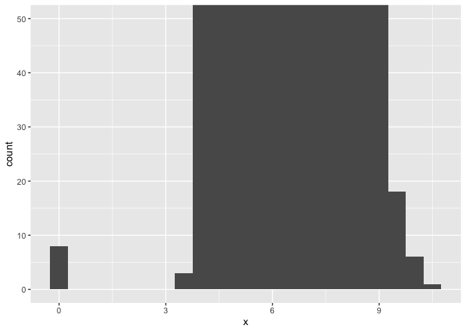<!-- -->

``` r
ggplot(diamonds, aes(x = y)) + 
  geom_histogram(binwidth = 0.5) +
  coord_cartesian(ylim = c(0, 50))
```

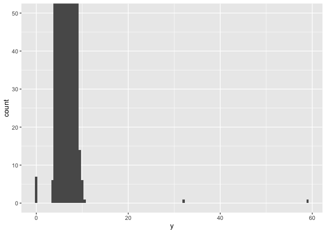<!-- -->

``` r
ggplot(diamonds, aes(x = z)) + 
  geom_histogram(binwidth = 0.5) +
  coord_cartesian(ylim = c(0, 50))
```

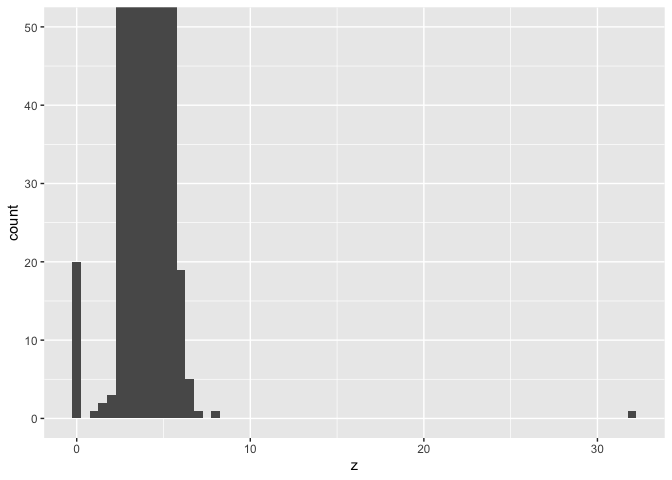<!-- -->

**Question 1–10.3.1**

The Z variable represents the depth since it shows every value is
concentrated below 10. X and Y represent length and width since the
concentration of those variables are all higher than the Z variable.
However, some of these values that the EDA produced show values of zero.
This must be incorrect, since diamonds cannot have a lenegth, width, or
depth of 0 mm.

``` r
ggplot(diamonds, aes(x = price)) + 
  geom_histogram(binwidth = 25) +
  coord_cartesian(ylim = c(0, 50))
```

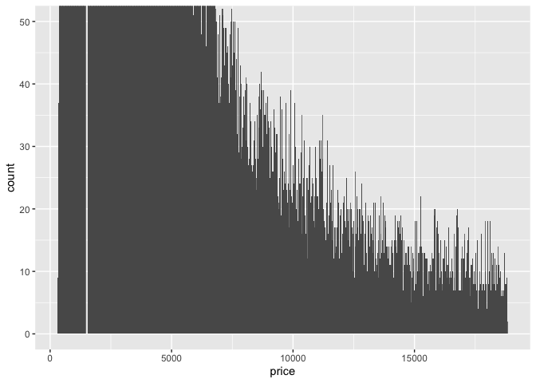<!-- -->

**Question 2–10.3.1**

Price is right skewed, with most diamonds clustered under \$5,000, with
a max of \$18,000. Since the binwidths are so small, we are able to see
a lot of spikes in the histogram, depicting that the number of diamonds
varies a lot depending on the price. These could indicate common prices
in certain gaps of prices offered.

``` r
carat1 <- diamonds |> 
  filter(carat == .99)
count(carat1)
```

    ## # A tibble: 1 × 1
    ##       n
    ##   <int>
    ## 1    23

``` r
carat2 <- diamonds |> 
  filter(carat == 1)
count(carat2)
```

    ## # A tibble: 1 × 1
    ##       n
    ##   <int>
    ## 1  1558

**Question 3–10.3.1**

There are 23 diamonds in .99 carat and 1,558 diamonds in 1 carat. The
cause of the difference could be that the sell price of a 1 carat is so
much more than a .99 carat, so they will go the extra .01 to ensure that
they can sell the diamonds at a higher price to consumers.

``` r
ggplot(diamonds, aes(x = price)) +
  geom_histogram() + xlim(0, 5000)
```

    ## `stat_bin()` using `bins = 30`. Pick better value with `binwidth`.

    ## Warning: Removed 14714 rows containing non-finite outside the scale range
    ## (`stat_bin()`).

    ## Warning: Removed 2 rows containing missing values or values outside the scale range
    ## (`geom_bar()`).

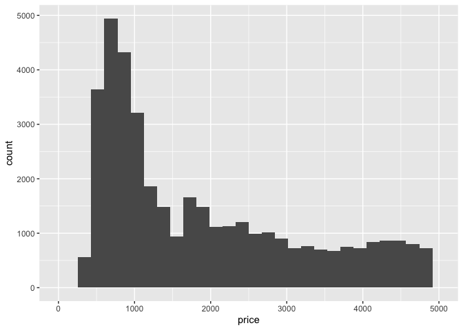<!-- -->

``` r
ggplot(diamonds, aes(x = price)) +
  geom_histogram() + coord_cartesian(xlim = c(0, 5000))
```

    ## `stat_bin()` using `bins = 30`. Pick better value with `binwidth`.

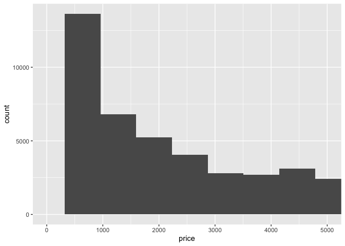<!-- -->

**Question 4–10.3.1**

If you leave binwidth unset, then the one without coord_cartesian has
smaller binwidths, making it look more varied among prices of the
diamond in the dataset. The one with coord_cartesian has wider bins,
which shows a more straight-forward depiction of the prices of the
diamonds. The second histogram also shows that there are prices higher
than \$5,000, where as the first one does not. The first one shows more
variety in the prices due to the peaks of the bars. If you try and zoom
so half a bar is shown, the entire bins in the first histogram may be
excluded since the data in that bin is gone whereas for coord_cartesian,
it will show a partial bar at the edge.

``` r
library(nycflights13)
library(dplyr)
```

``` r
str(flights)
```

    ## tibble [336,776 × 19] (S3: tbl_df/tbl/data.frame)
    ##  $ year          : int [1:336776] 2013 2013 2013 2013 2013 2013 2013 2013 2013 2013 ...
    ##  $ month         : int [1:336776] 1 1 1 1 1 1 1 1 1 1 ...
    ##  $ day           : int [1:336776] 1 1 1 1 1 1 1 1 1 1 ...
    ##  $ dep_time      : int [1:336776] 517 533 542 544 554 554 555 557 557 558 ...
    ##  $ sched_dep_time: int [1:336776] 515 529 540 545 600 558 600 600 600 600 ...
    ##  $ dep_delay     : num [1:336776] 2 4 2 -1 -6 -4 -5 -3 -3 -2 ...
    ##  $ arr_time      : int [1:336776] 830 850 923 1004 812 740 913 709 838 753 ...
    ##  $ sched_arr_time: int [1:336776] 819 830 850 1022 837 728 854 723 846 745 ...
    ##  $ arr_delay     : num [1:336776] 11 20 33 -18 -25 12 19 -14 -8 8 ...
    ##  $ carrier       : chr [1:336776] "UA" "UA" "AA" "B6" ...
    ##  $ flight        : int [1:336776] 1545 1714 1141 725 461 1696 507 5708 79 301 ...
    ##  $ tailnum       : chr [1:336776] "N14228" "N24211" "N619AA" "N804JB" ...
    ##  $ origin        : chr [1:336776] "EWR" "LGA" "JFK" "JFK" ...
    ##  $ dest          : chr [1:336776] "IAH" "IAH" "MIA" "BQN" ...
    ##  $ air_time      : num [1:336776] 227 227 160 183 116 150 158 53 140 138 ...
    ##  $ distance      : num [1:336776] 1400 1416 1089 1576 762 ...
    ##  $ hour          : num [1:336776] 5 5 5 5 6 5 6 6 6 6 ...
    ##  $ minute        : num [1:336776] 15 29 40 45 0 58 0 0 0 0 ...
    ##  $ time_hour     : POSIXct[1:336776], format: "2013-01-01 05:00:00" "2013-01-01 05:00:00" ...

``` r
ggplot(flights, aes(x = dep_delay)) + 
  geom_histogram()
```

    ## `stat_bin()` using `bins = 30`. Pick better value with `binwidth`.

    ## Warning: Removed 8255 rows containing non-finite outside the scale range
    ## (`stat_bin()`).

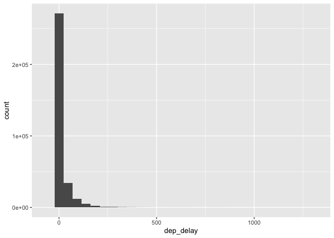<!-- -->

``` r
ggplot(flights, aes(x = carrier)) + 
  geom_bar()
```

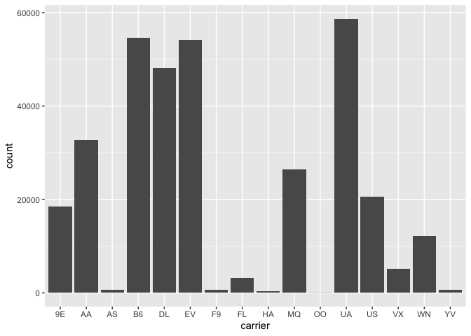<!-- -->

**Question 1–10.4.1**

When there are missing values in a histogram, they are removed from the
histogram and R presents a warning sign that says they have been
excluded. Although there are no missing values in carrier, if there was,
then they would also be dropped from the bar plot. (Essentially they are
the same, it just differs since a histogram uses numerical values and
bar plots use categorical variables.)

``` r
#Example data
data <-c(1,2,3,NA,5, 6)

mean(data, na.rm = TRUE)
```

    ## [1] 3.4

``` r
sum(data, na.rm = TRUE)
```

    ## [1] 17

**Question 2–10.4.1**

When you use the na.rm = TRUE using the mean and sum, then it calculates
the mean and the sum of the non-missing values and ignores the NA.

``` r
nycflights13::flights |> 
  mutate(
    cancelled = is.na(dep_time),
    sched_hour = sched_dep_time %/% 100,
    sched_min = sched_dep_time %% 100, 
    sched_dep_time = sched_hour + (sched_min / 60) 
  ) |> 
  ggplot(aes(x = sched_dep_time)) + 
  geom_freqpoly(aes(color = cancelled), binwidth = 1/4) + 
  facet_wrap(~ cancelled, scales = "free")
```

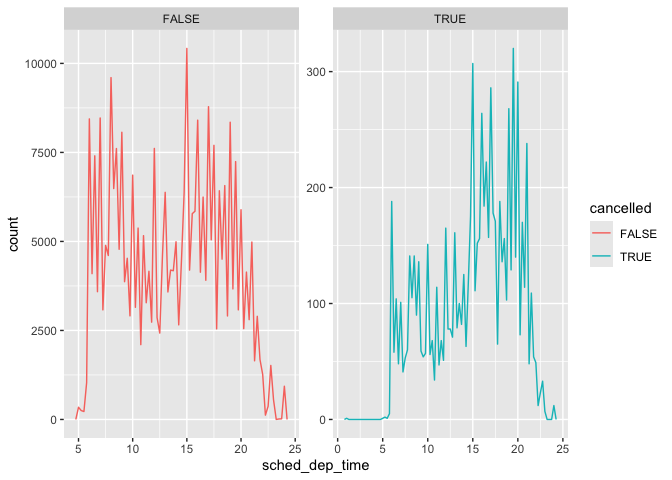<!-- -->

``` r
nycflights13::flights |> 
  mutate(
    cancelled = is.na(dep_time),
    sched_hour = sched_dep_time %/% 100,  
    sched_min = sched_dep_time %% 100, 
    sched_dep_time = sched_hour + (sched_min / 60) 
  ) |> 
  ggplot(aes(x = sched_dep_time)) + 
  geom_freqpoly(aes(color = cancelled), binwidth = 1/4) + 
  facet_wrap(~ cancelled, scales = "fixed")
```

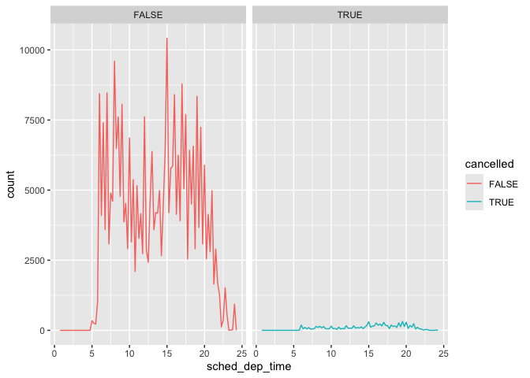<!-- -->

``` r
nycflights13::flights |> 
  mutate(
    cancelled = is.na(dep_time),
    sched_hour = sched_dep_time %/% 100, 
    sched_min = sched_dep_time %% 100, 
    sched_dep_time = sched_hour + (sched_min / 60)
  ) |> 
  ggplot(aes(x = sched_dep_time)) + 
  geom_freqpoly(aes(color = cancelled), binwidth = 1/4) + 
  facet_wrap(~ cancelled, scales = "free_y")
```

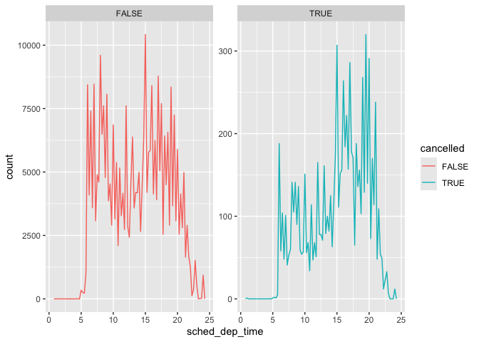<!-- -->

**Question 3–10.4.1**

The free scale shows two line graphs, but the y-axis is different,
depending on how large the y-axis permit for the data. It also just
includes the range for the x-axis for the dataset. This can make the
data visualization look a bit deceiving. The fixed scale has the same
y-axis for both line graphs, making both of them comparable when trying
to understand what the data is telling us. The free_y only frees the
y-axis, which limits it due to the range.
